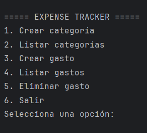

# Solución del proyecto

- **Proyecto:** Gestor de Gastos Personales 
- **Alumno/a:** Indalecio Domínguez Hita 
- **Repositorio:** https://github.com/IES-Rafael-Alberti/2526-u8u9-9-1-proyectolibre-indadominguez 

## 1. Resumen del proyecto

- **Problema que resuelve:** Esta aplicación permite registrar, consultar y analizar gastos de forma sencilla, ayudando a mejorar el control económico personal.


- **Usuarios principales:** Usuarios individuales que quieran controlar sus finanzas personales,estudiantes o trabajadores que deseen organizar sus gastos, cualquier persona interesada en llevar un registro de ingresos y gastos.


- **Funcionalidades principales:** 
  - Alta de gastos
  - Consulta de gastos
  - Modificación de gastos
  - Eliminación de gastos
  - Gestión de categorías
  - Exportación de gastos a CSV
  - Registro de eventos y logs
  - Validación de datos (fechas, cantidades, texto)
  - Consulta de historial de acciones 
  

- **Entidades principales:**  
  - Gasto (principal): id, fecha, cantidad, descripción, categoría
  - Categoria: id, nombre
  - LogEvento: fecha, tipo, descripción 
  

- **Estructura del proyecto:** 
```text
src/main/kotlin/
├── app/          -> punto de entrada
├── model/        -> clases del dominio
├── service/      -> lógica de negocio
├── repository/   -> acceso a ficheros, MongoDB y SQL
├── validator/    -> validaciones
├── exception/    -> excepciones propias
└── util/         -> utilidades
```

## 2. Instalación y ejecución

```bash
# Comandos necesarios para ejecutar el proyecto
./gradlew run
```

- **Requisitos previos:** <!-- JDK, MongoDB, SGBD, variables de entorno -->
- **Configuración necesaria:** <!-- Ficheros, puertos, datos de prueba -->
- **Datos de prueba incluidos:** <!-- Dónde están y cómo se usan -->

## 3. Diseño y model

- **Clases principales:** <!-- Clase -> responsabilidad -->
- **Relaciones importantes:** <!-- Herencia, interfaces, composición -->
- **Genéricos usados:** <!-- Clase/interfaz/función y motivo -->
- **Colecciones usadas:** <!-- Tipo, uso y justificación -->
- **Principios SOLID aplicados:** <!-- Al menos dos, con enlace al código -->
- **Patrones de diseño:** <!-- Patrón, problema que resuelve y enlace -->

## 4. Persistencia

### Ficheros

- **Ficheros usados:** <!-- Nombre y ruta -->
- **Formato y contenido:** <!-- CSV, JSON, TXT... -->
- **Lectura/escritura:** <!-- Qué operaciones realiza -->
- **Clase responsable:** <!-- Enlace al código -->
- **Errores controlados:** <!-- Qué ocurre si falla -->

### MongoDB

- **Base de datos:** <!-- Nombre -->
- **Colecciones:** <!-- Nombre y uso -->
- **Documento de ejemplo:**

```json
{
  "campo": "valor"
}
```

- **Operaciones realizadas:** <!-- Insertar, consultar, modificar, borrar -->
- **Clase responsable:** <!-- Enlace al código -->

### Base de datos relacional

- **SGBD utilizado:** <!-- H2, SQLite, MySQL... -->
- **Script SQL:** <!-- Ruta del script -->
- **Tablas y relaciones:** <!-- Resumen -->
- **Operaciones CRUD:** <!-- Qué entidades cubren -->
- **Consultas parametrizadas:** <!-- Enlace a ejemplo en código -->
- **Gestión de conexión y cierre:** <!-- Enlace al código -->

## 5. Validaciones y errores

- **Expresiones regulares:** <!-- Dato, regex, ejemplo válido/no válido, enlace -->
- **Excepciones controladas:** <!-- Tipo de error y respuesta del programa -->
- **Excepciones propias:** <!-- Si existen, indicar clase y motivo -->

## 6. Pruebas y evidencias

- **Pruebas realizadas:** Prueba del menu en consola 
- **Datos de prueba:** <!-- Qué datos se usaron -->
- **Evidencia de ejecución:** <!-- Salida de consola o captura -->
- **Evidencia de ficheros:** <!-- Fichero generado/leído -->
- **Evidencia de MongoDB:** <!-- Inserción/consulta -->
- **Evidencia de SQL:** <!-- CRUD realizado -->

## 7. Refactorización, documentación y Git

- **Refactorizaciones aplicadas:** <!-- Qué se mejoró y por qué -->
- **Código limpio:** <!-- Ejemplos concretos -->
- **Documentación:** <!-- KDoc, Dokka, README, diagramas... -->
- **Control de versiones:** <!-- Commits, ramas, conflictos si los hubo -->

## 8. Problemas encontrados y soluciones

| Problema | Solución aplicada | Enlace o evidencia |
|----------|-------------------|--------------------|
| <!-- Problema --> | <!-- Solución --> | <!-- Enlace --> |

## 9. Respuestas a los criterios de evaluación

Completa cada criterio con una respuesta breve (Por ejemplo, si habla de clases puedes listar las mas importantes, y entrar en detalle en alguna), técnica y con enlaces al código.

### 9.1. Diseño general

<!-- Temática, problema, entidades, funcionalidades, estructura y justificación. -->

### 9.2. Clases y objetos

<!-- Clases, propiedades, métodos, constructores, objetos instanciados y enlaces al código. -->

### 9.3. Encapsulación y visibilidad

<!-- Propiedades públicas/privadas, validaciones, métodos de modificación y decisiones. -->

### 9.4. Colecciones

<!-- Tipo de colección, información almacenada, motivo de elección y enlace al código. -->

### 9.5. Genéricos

<!-- Elemento genérico creado, problema que resuelve, ventaja y enlace al código. -->

### 9.6. Herencia, interfaces o clases abstractas

<!-- Relación entre clases/interfaces, ventaja, polimorfismo si existe y enlace al código. -->

### 9.7. Expresiones regulares

<!-- Dato validado, expresión regular, ejemplo válido, ejemplo no válido y enlace al código. -->

### 9.8. Ficheros

<!-- Ficheros, operaciones de lectura/escritura, formato, errores controlados y enlace al código. -->

### 9.9. MongoDB

<!-- Base de datos, colecciones, documentos, operaciones realizadas y enlace al código. -->

### 9.10. Base de datos relacional

<!-- SGBD, tablas, relaciones, script SQL, CRUD, conexión, cierre de recursos, consultas parametrizadas y enlace al código. -->

### 9.11. Excepciones

<!-- Errores controlados, excepciones propias, comportamiento ante error, ejemplos y enlace al código. -->

### 9.12. SOLID y buenas prácticas

<!-- Principios aplicados, clases donde aparecen, problema que evitan, mejora aportada y enlace al código. -->

### 9.13. Librerías externas

<!-- Nombre, finalidad, configuración, uso en código y motivo. -->

### 9.14. Pruebas y evidencias

Salida por consola del menú antes de añadir memoria al programa


### 9.15. Refactorización y código limpio

<!-- Técnicas aplicadas, mejoras conseguidas, ejemplos y enlaces. -->

### 9.16. Patrones de diseño

<!-- Patrón aplicado, ubicación, problema que resuelve, ventaja y enlace al código. -->

### 9.17. Documentación

<!-- Herramientas, partes documentadas, formato, ejemplo y enlace. -->

### 9.18. Control de versiones

<!-- Git, commits, ramas, conflictos si existen, repositorio e historial. -->

## 10. Conclusiones

- **Qué he aprendido:** <!-- Resumen -->
- **Qué mejoraría si tuviera más tiempo:** <!-- Mejoras realistas -->
- **Decisión técnica más importante:** <!-- Decisión y motivo -->

## 11. Autoevaluación

Indica en cada criterio el nivel o puntuación que consideras que has alcanzado. Usa la escala de la guía de evaluación: `0`, `2.5`, `5`, `7.5` o `10`. Justifica siempre la puntuación con evidencias concretas: clases, funciones, commits, capturas, documentación o enlaces al código.

### 11.1. Programación

| Criterio | Puntuación/Nivel | Justificación de la puntuación |
|----------|------------------|--------------------------------|
| Completitud de requisitos mínimos | <!-- 0 / 2.5 / 5 / 7.5 / 10 --> | <!-- Justifica el cumplimiento de POO, colecciones, genéricos, herencia/interfaces, regex, excepciones, SOLID, librerías, pruebas y evidencias. --> |
| Acceso a ficheros | <!-- 0 / 2.5 / 5 / 7.5 / 10 --> | <!-- Indica ficheros usados, formato, operaciones de lectura/escritura, clase responsable y control de errores. --> |
| Integración de MongoDB | <!-- 0 / 2.5 / 5 / 7.5 / 10 --> | <!-- Indica base de datos, colecciones, documentos, operaciones y clase responsable. --> |
| Base de datos relacional y operaciones CRUD | <!-- 0 / 2.5 / 5 / 7.5 / 10 --> | <!-- Indica SGBD, tablas, relaciones, script SQL, CRUD, conexión, cierre de recursos y consultas parametrizadas. --> |
| Preguntas de evaluación de Programación | <!-- 0 / 2.5 / 5 / 7.5 / 10 --> | <!-- Justifica si las respuestas de Programación están completas, son técnicas e incluyen enlaces y evidencias. --> |

### 11.2. Entornos de Desarrollo

| Criterio | Puntuación/Nivel | Justificación de la puntuación |
|----------|------------------|--------------------------------|
| Refactorización y código limpio | <!-- 0 / 2.5 / 5 / 7.5 / 10 --> | <!-- Refactorizaciones, técnicas aplicadas, mejoras y ejemplos. --> |
| Patrones de diseño | <!-- 0 / 2.5 / 5 / 7.5 / 10 --> | <!-- Patrón usado, ubicación, problema resuelto y ventaja. --> |
| Documentación | <!-- 0 / 2.5 / 5 / 7.5 / 10 --> | <!-- Herramientas, partes documentadas, formato y ejemplo. --> |
| Control de versiones | <!-- 0 / 2.5 / 5 / 7.5 / 10 --> | <!-- Commits, ramas, repositorio, conflictos si existen e historial. --> |
| Preguntas de evaluación de Entornos de Desarrollo | <!-- 0 / 2.5 / 5 / 7.5 / 10 --> | <!-- Justifica si las respuestas de Entornos están completas, son técnicas e incluyen enlaces y evidencias. --> |
