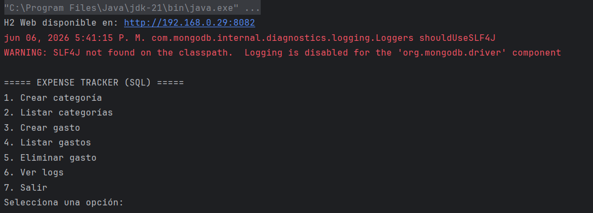
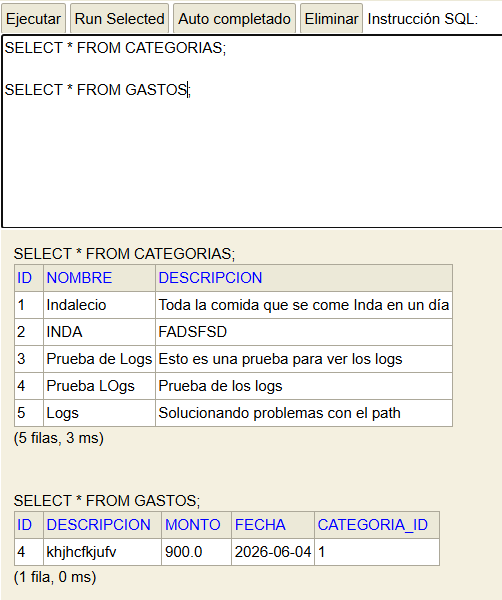
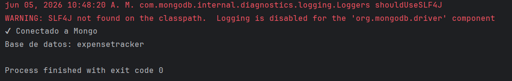
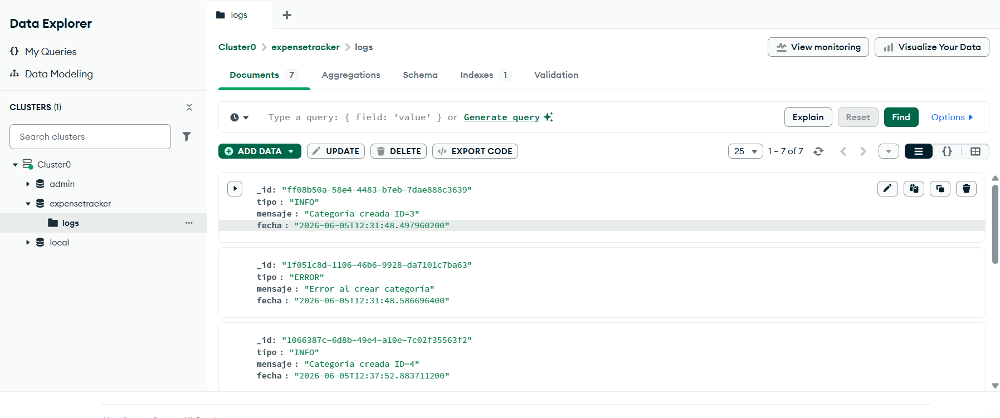

# Solución del proyecto

- **Proyecto:** Gestor de Gastos Personales 
- **Alumno/a:** Indalecio Domínguez Hita 
- **Repositorio:** https://github.com/IES-Rafael-Alberti/2526-u8u9-9-1-proyectolibre-indadominguez 

## 1. Resumen del proyecto

- **Problema que resuelve:** Esta aplicación permite registrar, consultar y analizar gastos de forma sencilla, ayudando a mejorar el control económico personal.


- **Usuarios principales:** Usuarios individuales que quieran controlar sus finanzas personales,estudiantes o trabajadores que deseen organizar sus gastos, cualquier persona interesada en llevar un registro de ingresos y gastos.


- **Funcionalidades principales:** 
  - Alta de gastos
  - Consulta de gastos
  - Modificación de gastos
  - Eliminación de gastos
  - Gestión de categorías
  - Exportación de gastos a CSV
  - Registro de eventos y logs
  - Validación de datos (fechas, cantidades, texto)
  - Consulta de historial de acciones 
  

- **Entidades principales:**  
  - Gasto (principal): id, fecha, cantidad, descripción, categoría
  - Categoria: id, nombre
  - LogEvento: fecha, tipo, descripción 
  

- **Estructura del proyecto:** 
```text
src/main/kotlin/
├── app/          -> punto de entrada
├── model/        -> clases del dominio
├── service/      -> lógica de negocio
├── repository/   -> acceso a ficheros, MongoDB y SQL
├── validator/    -> validaciones
├── exception/    -> excepciones propias
└── util/         -> utilidades
```

## 2. Instalación y ejecución

```bash
# Comandos necesarios para ejecutar el proyecto
./gradlew run
```

- **Requisitos previos:** 

  - Tener instalado JDK 21 o superior.
  - Tener conexión a internet para acceder a MongoDB Atlas.
  - Tener configurada una variable de entorno para la contraseña de MongoDB.


- **Configuración necesaria:** 

  - La base de datos relacional se configura automáticamente usando H2, creando un fichero en:
    data/expensetracker.mv.db
  - La base de datos NoSQL (MongoDB) se conecta mediante la URI definida en:
    repository/mongo/MongoManager.kt
  - El fichero de logs se genera automáticamente en:
    data/logs.txt
  

- **Datos de prueba incluidos:** 

  - No se incluyen datos iniciales predefinidos, pero la aplicación permite crear datos fácilmente desde la consola:

    - Crear categorías
    - Crear gastos asociados
    - Generar logs automáticamente

  - Estos datos se almacenan en:

    - H2 → gastos y categorías
    - MongoDB → logs
    - Fichero → logs en texto


## 3. Diseño y model

- **Clases principales:** 

  - Gasto → Representa un gasto individual con descripción, monto, fecha y categoría asociada.
    https://github.com/IES-Rafael-Alberti/2526-u8u9-9-1-proyectolibre-indadominguez/blob/b43e703ff60fb4d28bc2bedcaf8fe1cb9b656a86/src/main/kotlin/model/Gasto.kt#L1-L11
  
  - Categoria → Representa una categoría de gasto con nombre y descripción.
    https://github.com/IES-Rafael-Alberti/2526-u8u9-9-1-proyectolibre-indadominguez/blob/b43e703ff60fb4d28bc2bedcaf8fe1cb9b656a86/src/main/kotlin/model/Categoria.kt#L1-L7

  - DataBase → Gestiona la conexión y creación de la base de datos H2.
    https://github.com/IES-Rafael-Alberti/2526-u8u9-9-1-proyectolibre-indadominguez/blob/b43e703ff60fb4d28bc2bedcaf8fe1cb9b656a86/src/main/kotlin/repository/sql/Database.kt#L7-L69

- **Relaciones importantes:**

  - Interfaces (polimorfismo):
    - IRepository<T, ID> define operaciones CRUD genéricas.
    - ICategoriaRepository y IGastoRepository extienden esta interfaz.
    - Permite cambiar la implementación (memoria, SQL) sin modificar la lógica de negocio.
      https://github.com/IES-Rafael-Alberti/2526-u8u9-9-1-proyectolibre-indadominguez/blob/b43e703ff60fb4d28bc2bedcaf8fe1cb9b656a86/src/main/kotlin/repository/IRepository.kt#L1-L9

  - Composición:
    - Los servicios (CategoriaService, GastoService) dependen de repositorios.
    - LogService depende de dos repositorios (Mongo + fichero).
      https://github.com/IES-Rafael-Alberti/2526-u8u9-9-1-proyectolibre-indadominguez/blob/b43e703ff60fb4d28bc2bedcaf8fe1cb9b656a86/src/main/kotlin/service/GastoService.kt#L9-L49
      CategoriaService y GastoService tienen implementado todas las operaciones CRUD, aunque no todas se utilicen, debe de estar todo preparado para mejoras.  

  - Separación por capas:
    - model → datos
    - repository → acceso a datos
    - service → lógica de negocio
    - app → interfaz de usuario (consola)
  

- **Genéricos usados:** 

  - Se utiliza la interfaz genérica:
  IRepository<T, ID>
  - Permite reutilizar operaciones CRUD para distintas entidades (Gasto, Categoria, LogEvento).
  - Mejora la reutilización del código y reduce duplicación.
    https://github.com/IES-Rafael-Alberti/2526-u8u9-9-1-proyectolibre-indadominguez/blob/b43e703ff60fb4d28bc2bedcaf8fe1cb9b656a86/src/main/kotlin/repository/IRepository.kt#L1-L9


- **Colecciones usadas:** <!-- Tipo, uso y justificación -->

  - MutableList
    - Usada en repositorios en memoria (CategoriaRepositoryMemory, GastoRepositoryMemory).
    - Permite almacenar, buscar, actualizar y eliminar elementos fácilmente.
      https://github.com/IES-Rafael-Alberti/2526-u8u9-9-1-proyectolibre-indadominguez/blob/b43e703ff60fb4d28bc2bedcaf8fe1cb9b656a86/src/main/kotlin/repository/memory/CategoriaRepositoryMemory.kt#L6-L8
    
  - List
    - Usada como retorno en consultas (findAll, filtros).
    - Permite trabajar con colecciones inmutables de forma segura.
      https://github.com/IES-Rafael-Alberti/2526-u8u9-9-1-proyectolibre-indadominguez/blob/b43e703ff60fb4d28bc2bedcaf8fe1cb9b656a86/src/main/kotlin/service/CategoriaService.kt#L24-L26
      Ejemplo dentro de CategoriaService
    
      
- **Principios SOLID aplicados:** 

  - S (Single Responsibility Principle):
    - Cada clase tiene una única responsabilidad.
    - Ejemplo:
      - GastoService → lógica de negocio
      - GastoRepositorySQL → acceso a datos
      - GastoValidator → validaciones
        https://github.com/IES-Rafael-Alberti/2526-u8u9-9-1-proyectolibre-indadominguez/blob/b43e703ff60fb4d28bc2bedcaf8fe1cb9b656a86/src/main/kotlin/repository/file/LogFileRepository.kt#L9
        
  - D (Dependency Inversion Principle):
    - Los servicios dependen de interfaces (IGastoRepository, ICategoriaRepository) y no de implementaciones concretas.
    - Permite cambiar fácilmente entre repositorio en memoria y SQL sin modificar la lógica.
      https://github.com/IES-Rafael-Alberti/2526-u8u9-9-1-proyectolibre-indadominguez/blob/b43e703ff60fb4d28bc2bedcaf8fe1cb9b656a86/src/main/kotlin/service/CategoriaService.kt#L8


- **Patrones de diseño:** 

  - Patrón Repository:
    - Separa la lógica de acceso a datos de la lógica de negocio.
    - Implementado mediante IRepository y sus implementaciones (SQL, memoria, Mongo).
      https://github.com/IES-Rafael-Alberti/2526-u8u9-9-1-proyectolibre-indadominguez/blob/b43e703ff60fb4d28bc2bedcaf8fe1cb9b656a86/src/main/kotlin/repository/IRepository.kt#L3-L9
      https://github.com/IES-Rafael-Alberti/2526-u8u9-9-1-proyectolibre-indadominguez/blob/b43e703ff60fb4d28bc2bedcaf8fe1cb9b656a86/src/main/kotlin/repository/ICategoriaRepository.kt#L5-L7

  - Patrón DAO (Data Access Object):
    - Clases como GastoRepositorySQL encapsulan el acceso a la base de datos.
      https://github.com/IES-Rafael-Alberti/2526-u8u9-9-1-proyectolibre-indadominguez/blob/b43e703ff60fb4d28bc2bedcaf8fe1cb9b656a86/src/main/kotlin/repository/sql/GastoRepositorySQL.kt#L9-L155      

  - Patrón Singleton:
    - DataBase y MongoManager se implementan como objetos (object en Kotlin).
    - Garantiza una única instancia de conexión.
      https://github.com/IES-Rafael-Alberti/2526-u8u9-9-1-proyectolibre-indadominguez/blob/c0d5b6aa4c3a71155eb5b983e649cfd4eba379df/src/main/kotlin/repository/sql/Database.kt#L7-L69
      https://github.com/IES-Rafael-Alberti/2526-u8u9-9-1-proyectolibre-indadominguez/blob/c0d5b6aa4c3a71155eb5b983e649cfd4eba379df/src/main/kotlin/repository/mongo/MongoManager.kt#L7-L24

  - Arquitectura en capas:
    - Separación clara entre modelo, repositorio, servicio y presentación.
    - Facilita mantenimiento, pruebas y escalabilidad.


## 4. Persistencia

### Ficheros

- **Ficheros usados:** 

  - data/logs.txt
  
- **Formato y contenido:** 

  - Formato: TXT (texto plano).
  - Cada línea representa un log con el siguiente formato:
    - [fecha] [tipo] mensaje
  - Ejemplo:
    - [2026-06-05T12:43:45.930] [INFO] Categoría creada ID=5

- **Lectura/escritura:** 

  - Escritura:
    - Se añaden nuevas líneas al fichero usando Files.writeString con las opciones CREATE y APPEND.
    - Se crea automáticamente el fichero si no existe.
  - Lectura:
    - Se leen todas las líneas del fichero mediante Files.readAllLines.
    - Se devuelven como una lista de strings.

- **Clase responsable:** 

  https://github.com/IES-Rafael-Alberti/2526-u8u9-9-1-proyectolibre-indadominguez/blob/c0d5b6aa4c3a71155eb5b983e649cfd4eba379df/src/main/kotlin/repository/file/LogFileRepository.kt#L9-L47
  
- **Errores controlados:** 

  - Se capturan excepciones durante la lectura y escritura del fichero.
  - En caso de error, se lanza una excepción propia PersistenciaException.
  - Esto evita que la aplicación falle y permite gestionar los errores de forma controlada.
  - Ejemplo:
    - throw PersistenciaException("Error al guardar log en archivo $ruta", e)


### MongoDB

- **Base de datos:** 

  expensetracker

- **Colecciones:** 

  - logeventos → almacena los logs generados por la aplicación (acciones, errores, operaciones realizadas).

- **Documento de ejemplo:**

```json
{ "_id": "ff08b50a-58e4-4483-b7eb-7dae888c3639", 
  "tipo": "INFO", 
  "mensaje": "Categoría creada ID=5", 
  "fecha": "2026-06-05T12:43:45.930" }
```

- **Operaciones realizadas:** 

  - Insertar:
    - Se insertan logs automáticamente al realizar acciones como crear categorías o gastos.
  - Consultar:
    - Se recuperan todos los logs desde la consola.
  - Filtrar:
    - Se pueden consultar logs por tipo (INFO, ERROR).
    - No se realizan operaciones de actualización o borrado, ya que los logs se mantienen como historial inmutable.
  
- **Clase responsable:** 

  https://github.com/IES-Rafael-Alberti/2526-u8u9-9-1-proyectolibre-indadominguez/blob/c0d5b6aa4c3a71155eb5b983e649cfd4eba379df/src/main/kotlin/repository/mongo/LogRepositoryMongo.kt#L8-L48
  https://github.com/IES-Rafael-Alberti/2526-u8u9-9-1-proyectolibre-indadominguez/blob/c0d5b6aa4c3a71155eb5b983e649cfd4eba379df/src/main/kotlin/repository/mongo/MongoManager.kt#L7-L24


### Base de datos relacional

- **SGBD utilizado:** 

  - Se utiliza H2 Database ya que es la base de datos relacional que siempre he usado al ser muy ligera.
  
- **Script SQL:**

  - No se utiliza un fichero .sql externo.
  - La creación de tablas se realiza automáticamente en el código en:
    - repository/sql/DataBase.kt
      Método: initDatabase() 
    
- **Tablas y relaciones:** 

  - CATEGORIAS
    - id (PK)
    - nombre (único)
    - descripcion
  - GASTOS
    - id (PK)
    - descripcion
    - monto
    - fecha
    - categoria_id (FK)
  - Relación:
    - Un gasto pertenece a una categoría (N:1)
    - Se define una clave foránea con ON DELETE CASCADE
  
- **Operaciones CRUD:**

  - Categoria
    - Crear → save
    - Leer → findAll, findById
    - Actualizar → update
    - Eliminar → delete
  - Gasto
    - Crear → save
    - Leer → findAll, findById
    - Eliminar → delete
  - Implementadas en:
    - CategoriaRepositorySQL.kt
    - GastoRepositorySQL.kt

- **Consultas parametrizadas:** 

  - https://github.com/IES-Rafael-Alberti/2526-u8u9-9-1-proyectolibre-indadominguez/blob/c0d5b6aa4c3a71155eb5b983e649cfd4eba379df/src/main/kotlin/repository/sql/CategoriaRepositorySQL.kt#L28-L44
  
- **Gestión de conexión y cierre:** 

  https://github.com/IES-Rafael-Alberti/2526-u8u9-9-1-proyectolibre-indadominguez/blob/c0d5b6aa4c3a71155eb5b983e649cfd4eba379df/src/main/kotlin/repository/sql/Database.kt#L22-L33
  - Se utiliza use {} para cerrar automáticamente recursos como Connection, Statement y ResultSet.
  - Esto evita fugas de memoria y asegura el correcto cierre de recursos.
  

## 5. Validaciones y errores

- **Expresiones regulares:** 

  - Datos: Nombre de la categoría.
  - Regex: private val NOMBRE_REGEX = Regex("^[a-zA-ZáéíóúÁÉÍÓÚñÑ ]{3,100}$")
  - Ejemplo válido: "Comida", "Transporte diario"
  - Ejemplo no válido: "", "123@", "@@@"
    https://github.com/IES-Rafael-Alberti/2526-u8u9-9-1-proyectolibre-indadominguez/blob/c0d5b6aa4c3a71155eb5b983e649cfd4eba379df/src/main/kotlin/validator/CategoriaValidator.kt#L7-L28
  
- **Excepciones controladas:** 

  - Tipo de error:
    - Entrada de datos incorrecta (números, fechas)
    - Errores de base de datos
    - Errores de ficheros
  - Respuesta del programa:
    - Se capturan mediante try-catch
    - Se muestra un mensaje de error por consola
    - La aplicación continúa ejecutándose
      https://github.com/IES-Rafael-Alberti/2526-u8u9-9-1-proyectolibre-indadominguez/blob/c0d5b6aa4c3a71155eb5b983e649cfd4eba379df/src/main/kotlin/repository/file/ExportacionCsvRepository.kt#L10-L26

- **Excepciones propias:**

  - ValidacionException: se utiliza para errores de lógica de negocio.
    - Por ejemplo, cuando se intenta crear una categoría con un nombre duplicado o cuando los datos no cumplen las validaciones.
    - Se lanza principalmente desde la capa de servicios, como en CategoriaService.
      https://github.com/IES-Rafael-Alberti/2526-u8u9-9-1-proyectolibre-indadominguez/blob/2fe87c5a6b03322631bedf9fd96e82d016912be3/src/main/kotlin/service/CategoriaService.kt#L14-L16

  - PersistenciaException: se utiliza para errores relacionados con el acceso a datos.
    - Por ejemplo, cuando falla la escritura o lectura de logs en fichero.
    - Se lanza en la capa de repositorio, concretamente en LogFileRepository.
      https://github.com/IES-Rafael-Alberti/2526-u8u9-9-1-proyectolibre-indadominguez/blob/2fe87c5a6b03322631bedf9fd96e82d016912be3/src/main/kotlin/repository/file/LogFileRepository.kt#L30-L32


## 6. Pruebas y evidencias

- **Pruebas realizadas:** 

  - 
  
- **Datos de prueba:** 

  - 

- **Evidencia de ejecución:** 

  - [MENU_CONSOLA](img_1.png)
  - 

- **Evidencia de ficheros:** 

  - Se genera el fichero:
    - data/logs.txt
    - Contiene los logs de la aplicación en formato texto plano. 
    https://github.com/IES-Rafael-Alberti/2526-u8u9-9-1-proyectolibre-indadominguez/blob/c0d5b6aa4c3a71155eb5b983e649cfd4eba379df/data/logs.txt#L1-L4
    
- **Evidencia de MongoDB:** 

  - 
  
- **Evidencia de SQL:** 

  - 


## 7. Refactorización, documentación y Git

- **Refactorizaciones aplicadas:**

  - Sustitución de repositorios en memoria por implementaciones SQL y Mongo, manteniendo la misma interfaz.
  
- **Código limpio:**

  - Uso de nombres descriptivos en variables y funciones (crearCategoria, listarGastos, eliminarGasto).
  - Métodos con una única responsabilidad (por ejemplo, registrar en servicios).
  - Uso de try-catch para controlar errores sin romper la ejecución.
  - Uso de List en lugar de MutableList en servicios para garantizar inmutabilidad.
  - Separación clara entre entrada de datos (consola) y lógica de negocio (servicios).
  
- **Documentación:** 

  - Este propio README con explicación del proyecto, estructura, instalación y funcionamiento.
  
- **Control de versiones:** 

  - Uso de Git mediante repositorio en GitHub.
  - Commits frecuentes para registrar avances del desarrollo.


## 8. Problemas encontrados y soluciones

| Problema | Solución aplicada | Enlace o evidencia |
|----------|-------------------|--------------------|
| Error al guardar logs en fichero (NullPointerException por la ruta) | Se cambió la ruta a data/logs.txt y se creó el directorio automáticamente con Files.createDirectories | https://github.com/IES-Rafael-Alberti/2526-u8u9-9-1-proyectolibre-indadominguez/blob/6d94dcb699d49dc9a0690c87e42feb1367122845/src/main/kotlin/repository/file/LogFileRepository.kt#L9-L19 |


## 9. Respuestas a los criterios de evaluación

Completa cada criterio con una respuesta breve (Por ejemplo, si habla de clases puedes listar las mas importantes, y entrar en detalle en alguna), técnica y con enlaces al código.


### 9.1. Diseño general

- Aplicación de consola para gestión de gastos personales. Entidades: Gasto, Categoria y LogEvento. Arquitectura en capas (app, service, repository, model) que separa presentación, lógica y persistencia.


### 9.2. Clases y objetos

- Clases principales: Gasto, Categoria, LogEvento.
https://github.com/IES-Rafael-Alberti/2526-u8u9-9-1-proyectolibre-indadominguez/blob/6d94dcb699d49dc9a0690c87e42feb1367122845/src/main/kotlin/model/Categoria.kt#L3-L7

- Servicios: GastoService, CategoriaService, LogService.
https://github.com/IES-Rafael-Alberti/2526-u8u9-9-1-proyectolibre-indadominguez/blob/6d94dcb699d49dc9a0690c87e42feb1367122845/src/main/kotlin/service/ExportacionService.kt#L6-L11

- Repositorios: SQL y Mongo.
https://github.com/IES-Rafael-Alberti/2526-u8u9-9-1-proyectolibre-indadominguez/blob/6d94dcb699d49dc9a0690c87e42feb1367122845/src/main/kotlin/repository/IRepository.kt#L3-L9

- Se instancian en la consola (Consola.kt).


### 9.3. Encapsulación y visibilidad

- Propiedades privadas en servicios y repositorios, para mayor encapsulación.
- Acceso mediante métodos (registrar, listar, eliminar).
- Validaciones antes de modificar datos.


### 9.4. Colecciones

- Uso de List para devolver datos (findAll).
- Permite inmutabilidad y seguridad en la lógica de negocio.
https://github.com/IES-Rafael-Alberti/2526-u8u9-9-1-proyectolibre-indadominguez/blob/6d94dcb699d49dc9a0690c87e42feb1367122845/src/main/kotlin/service/CategoriaService.kt#L24-L26


### 9.5. Genéricos

- Uso de interfaces genéricas como ILogRepository.
- Permite cambiar implementación (Mongo, fichero) sin modificar servicios.
https://github.com/IES-Rafael-Alberti/2526-u8u9-9-1-proyectolibre-indadominguez/blob/6d94dcb699d49dc9a0690c87e42feb1367122845/src/main/kotlin/repository/ILogRepository.kt#L5-L7


### 9.6. Herencia, interfaces o clases abstractas

- Interfaces como ICategoriaRepository, IGastoRepository, ILogRepository.
- Permiten polimorfismo y desacoplamiento entre capas.
https://github.com/IES-Rafael-Alberti/2526-u8u9-9-1-proyectolibre-indadominguez/blob/6d94dcb699d49dc9a0690c87e42feb1367122845/src/main/kotlin/repository/IGastoRepository.kt#L5-L8
https://github.com/IES-Rafael-Alberti/2526-u8u9-9-1-proyectolibre-indadominguez/blob/6d94dcb699d49dc9a0690c87e42feb1367122845/src/main/kotlin/repository/ICategoriaRepository.kt#L5-L7


### 9.7. Expresiones regulares

- Validación de nombre de categoría con regex:
- ^[a-zA-ZáéíóúÁÉÍÓÚñÑ ]{3,100}$
- Ejemplo válido: "Comida"
- No válido: "123@"
https://github.com/IES-Rafael-Alberti/2526-u8u9-9-1-proyectolibre-indadominguez/blob/6d94dcb699d49dc9a0690c87e42feb1367122845/src/main/kotlin/validator/CategoriaValidator.kt#L7-L9


### 9.8. Ficheros

- Fichero data/logs.txt.
- Lectura y escritura con Files.writeString y Files.readAllLines.
- Control de errores con excepciones.
https://github.com/IES-Rafael-Alberti/2526-u8u9-9-1-proyectolibre-indadominguez/blob/6d94dcb699d49dc9a0690c87e42feb1367122845/data/logs.txt#L1-L4


### 9.9. MongoDB

- Base de datos: expensetracker.
- Colección: logeventos.
- Operaciones: insertar (save) y consultar (findAll).
  https://github.com/IES-Rafael-Alberti/2526-u8u9-9-1-proyectolibre-indadominguez/blob/6d94dcb699d49dc9a0690c87e42feb1367122845/src/main/kotlin/repository/mongo/LogRepositoryMongo.kt#L8-L48


### 9.10. Base de datos relacional

- SGBD: H2.
- Tablas: CATEGORIAS y GASTOS (relación N:1).
- CRUD completo.
- Consultas con PreparedStatement.
  https://github.com/IES-Rafael-Alberti/2526-u8u9-9-1-proyectolibre-indadominguez/blob/6d94dcb699d49dc9a0690c87e42feb1367122845/src/main/kotlin/repository/sql/CategoriaRepositorySQL.kt#L8-L107


### 9.11. Excepciones

- Control con try-catch.
  - Excepciones propias:
    - ValidacionException
    - PersistenciaException
    - Evitan que la aplicación se detenga.
      https://github.com/IES-Rafael-Alberti/2526-u8u9-9-1-proyectolibre-indadominguez/blob/6d94dcb699d49dc9a0690c87e42feb1367122845/src/main/kotlin/repository/file/ExportacionCsvRepository.kt#L10-L26
    

### 9.12. SOLID y buenas prácticas

- SRP: cada clase tiene una responsabilidad (Service, Repository).
- DIP: servicios dependen de interfaces, no implementaciones.
- Mejora mantenimiento y escalabilidad.
  https://github.com/IES-Rafael-Alberti/2526-u8u9-9-1-proyectolibre-indadominguez/blob/b43e703ff60fb4d28bc2bedcaf8fe1cb9b656a86/src/main/kotlin/service/CategoriaService.kt#L8
  https://github.com/IES-Rafael-Alberti/2526-u8u9-9-1-proyectolibre-indadominguez/blob/b43e703ff60fb4d28bc2bedcaf8fe1cb9b656a86/src/main/kotlin/repository/file/LogFileRepository.kt#L9


### 9.13. Librerías externas

MongoDB Driver (mongodb-driver-sync) → conexión con Mongo Atlas.
H2 Database → base de datos relacional embebida.
https://github.com/IES-Rafael-Alberti/2526-u8u9-9-1-proyectolibre-indadominguez/blob/6d94dcb699d49dc9a0690c87e42feb1367122845/build.gradle.kts#L11-L14


### 9.14. Pruebas y evidencias

- Salida por consola del menú antes de añadir memoria al programa
  
  
  
  


### 9.15. Refactorización y código limpio

- Separación en capas.
- Nombres claros en métodos.
- Eliminación de código duplicado.
- Control de errores mejorado en LogService.
  https://github.com/IES-Rafael-Alberti/2526-u8u9-9-1-proyectolibre-indadominguez/blob/6d94dcb699d49dc9a0690c87e42feb1367122845/src/main/kotlin/service/LogService.kt#L7-L42


### 9.16. Patrones de diseño

- Repository → acceso a datos desacoplado
- DAO → repositorios SQL
- Singleton → DataBase, MongoManager
- Arquitectura en capas
  https://github.com/IES-Rafael-Alberti/2526-u8u9-9-1-proyectolibre-indadominguez/blob/6d94dcb699d49dc9a0690c87e42feb1367122845/src/main/kotlin/repository/mongo/MongoManager.kt#L7-L24


### 9.17. Documentación

La documentacion se encuentra en [SOLUCION_2526_PRO_u9_proyecto.md](SOLUCION_2526_PRO_u9_proyecto.md)


### 9.18. Control de versiones

Uso de Git y GitHub.
Commits frecuentes y evolución del proyecto documentada.
Repositorio:
https://github.com/IES-Rafael-Alberti/2526-u8u9-9-1-proyectolibre-indadominguez


## 10. Conclusiones

- **Qué he aprendido:**

  - He aprendido que los proyectos deben de hacerse con paciencia y teniendo claro que van a surgir fallos.
  
- **Qué mejoraría si tuviera más tiempo:**

  - Implementar interfaz gráfica (GUI) en lugar de consola.
  - Añadir edición de gastos y categorías desde el menú.
  - Mejorar validaciones (más campos y reglas).
  - Añadir tests automatizados.
  - Optimizar consultas y añadir filtros (por fecha, categoría, etc.).
  
- **Decisión técnica más importante:** 

  - Creo que la respuesta es un fácil ya que la decisión técnica más importante sin duda es:
    - Separar la aplicación en capas (app, service, repository).
      - Permite desacoplar la lógica de negocio del acceso a datos.
      - Gracias a esto, se ha podido usar SQL, MongoDB y ficheros sin cambiar la lógica principal.


## 11. Autoevaluación

Indica en cada criterio el nivel o puntuación que consideras que has alcanzado. Usa la escala de la guía de evaluación: `0`, `2.5`, `5`, `7.5` o `10`. Justifica siempre la puntuación con evidencias concretas: clases, funciones, commits, capturas, documentación o enlaces al código.


### 11.1. Programación

| Criterio | Puntuación/Nivel | Justificación de la puntuación |
|----------|------|--------------------------------|
| Completitud de requisitos mínimos | 7.5  | Se cumplen todos los requisitos: uso de POO (modelos y servicios), colecciones (List), interfaces (repositorios), expresiones regulares (validación de categorías), excepciones propias (ValidacionException, PersistenciaException), principios SOLID (SRP y DIP), uso de librerías externas (MongoDB y H2), y evidencias de funcionamiento (capturas, logs, consola). |
| Acceso a ficheros | 10   | Uso de fichero data/logs.txt en formato TXT. Se implementa lectura y escritura mediante Files.writeString y Files.readAllLines en LogFileRepository. Se controlan errores con try-catch y PersistenciaException.|
| Integración de MongoDB | 7.5  | Base de datos expensetracker con colección logeventos. Se realizan operaciones de inserción (save) y consulta (findAll). Implementado en LogRepositoryMongo y gestionado por MongoManager. Conexión mediante MongoDB Atlas.|
| Base de datos relacional y operaciones CRUD | 7.5  | Uso de H2 con tablas CATEGORIAS y GASTOS (relación N:1). CRUD completo implementado en repositorios SQL. Uso de PreparedStatement, gestión de conexión con DataBase y cierre de recursos con use.|
| Preguntas de evaluación de Programación | 10   | Todas las respuestas están completas, son técnicas y están justificadas. Incluyen referencias al código, ejemplos reales del proyecto y evidencias de funcionamiento. |
